<h1>Проект по тестированию web-приложения "RuStore"</h1>

> [Ссылка на сайт](https://www.rustore.ru/)

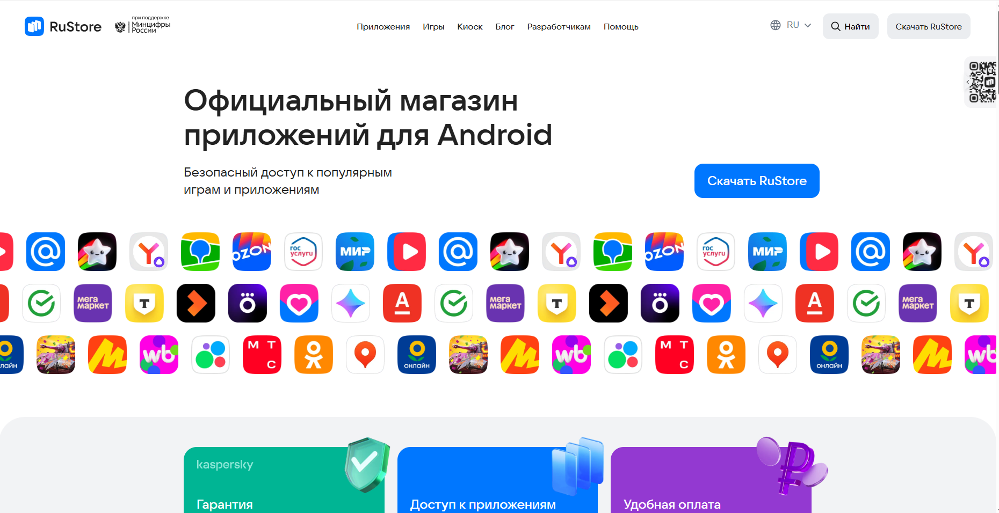

## 📖 Содержание

- <a href="#about">Описание проекта</a>
- <a href="#ui-tests">Что проверяется (UI-тесты)</a>
- <a href="#tools">Технологии и инструменты</a>
- Запуск тестов
    - <a href="#jenkins">Jenkins</a>
- Отчёты
    - <a href="#allure">Allure</a>
    - <a href="#allure-testops">Allure TestOps</a>
    - <a href="#jira">Jira</a>
- <a href="#telegram">Оповещение в Telegram</a>
- <a href="#video">Пример видео прохождения UI-автотестов</a>

---
<a id="about"></a>

## ✅ Описание проекта

1. Данный проект посвящён автоматизации UI-тестирования веб-приложения **RuStore**.
2. В рамках проекта реализованы UI-автотесты для проверки ключевых пользовательских сценариев работы с веб-версией
   RuStore.
3. Тесты написаны на языке Python с использованием фреймворков Pytest, Selene и Selenium WebDriver, а также
   интегрированы с системой отчетности Allure и CI-системой Jenkins.
4. Проект построен с использованием Page Object.
5. Результаты выполнения тестов автоматически формируются в виде наглядного Allure-отчета

---
<h3> Список проверок, реализованных в автотестах:</h3>

<a id="ui-tests"></a>
### UI-тесты

✅Проверка главной страницы RuStore

* Открытие главной страницы приложения
* Проверка наличия кнопки «Найти»

✅Проверка строки поиска

* Открытие поля поиска
* Ввод поискового запроса
* Проверка отображения введённого значения в поле поиска
* Поиск приложений по валидному запросу
* Отображение результатов поиска
* Поиск по несуществующему запросу
* Корректная обработка пустого поискового запроса
* Очистка поля поиска

---
<a id="tools"></a>
### Проект реализован с использованием:

<p>


<p>

- **Python** — язык программирования, на котором написаны UI-автотесты
- **Pytest** — фреймворк для организации и запуска тестовых сценариев
- **Selene** — фреймворк для UI-автотестирования на базе Selenium WebDriver
- **Selenoid** — инструмент для удалённого запуска браузеров в контейнерах
- **Jenkins** — CI-система для параметризованного запуска автотестов
- **Allure Report** — система формирования подробных отчётов о результатах тестирования
- **Allure TestOps** — платформа для управления тест-кейсами и аналитики прогонов
- **PyCharm** — среда разработки для написания и отладки автотестов
- **Jira** — система управления задачами и дефектами
- **Telegram** — канал для уведомлений о результатах выполнения тестов

---

### Локальный запуск

1. Склонировать репозиторий
2. Установить зависимости командой pip install -r requirements.txt
3. Открыть проект в PyCharm, установить интерпретатор
4. Создать .env файл, пример файла - .env.example, находится в корне проекта
5. Запустить тесты в командной строке

---
<a id="jenkins"></a>
###  Удаленный запуск автотестов выполняется на сервере Jenkins

### [Ссылка на сборку в Jenkins](https://jenkins.autotests.cloud/job/diplom_rustore_web_project_belevtseva/)

#### Для запуска автотестов в Jenkins

1. Открыть [Проект в Jenkins]((https://jenkins.autotests.cloud/job/diplom_rustore_web_project_belevtseva/))
2. Выбрать пункт `Build with Parameters`
3. Выбрать тип окружения
4. Выбрать комментарий к запуску
5. Нажать кнопку `Build`
6. Результат запуска сборки можно посмотреть в отчёте Allure
   

---
<a id="allure"></a>

###   Allure отчет
### [Ссылка на проект в Allure](

#### Формирование отчета:

- **локальный запуск**: ввести в командной строке```allure serve allure-results```
- **запуск через Jenkins**:  кликнуть кнопку ```Allure Report``` в боковом меню

#### Результаты запусков:

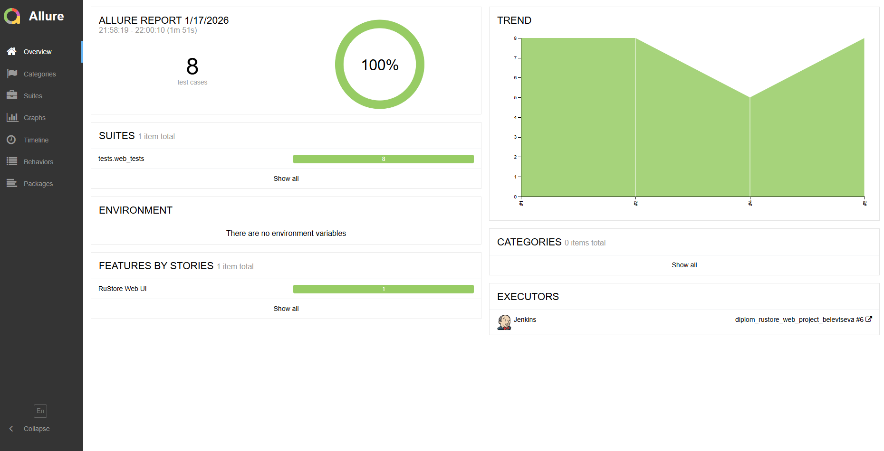
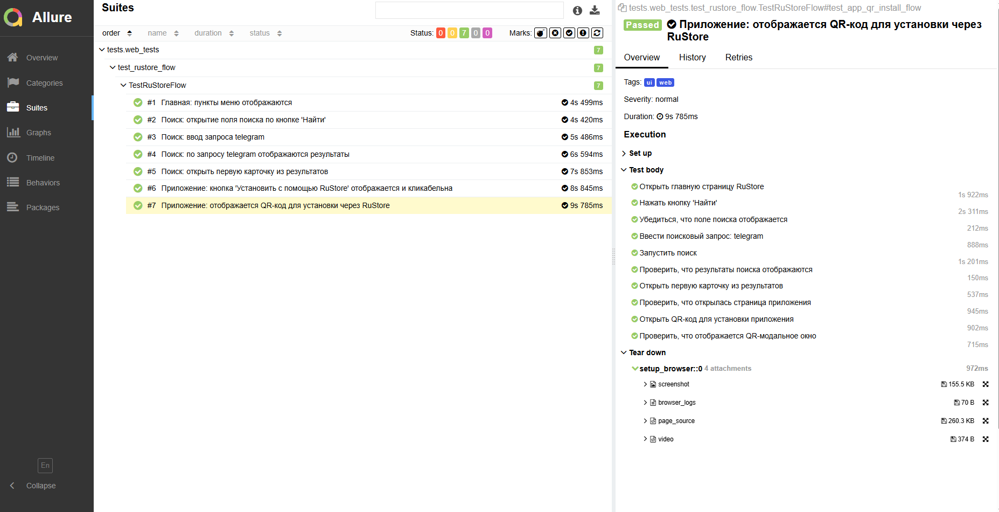
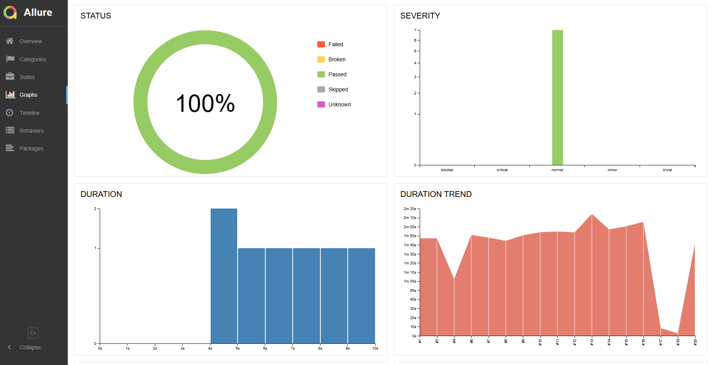

Отчет позволяет получить детальную информацию по все шагам тестов, включая скриншоты, log - файлы и видео о прохождение
теста,а так же позволяет оперативно понять причину падения теста.

---
<a id="allure-testops"></a>
###  Интеграция с Allure

### [Ссылка на проект в Allure TestOps](https://allure.autotests.cloud/project/5085/dashboards)

#### Пример dashboard с общими результатами тестирования

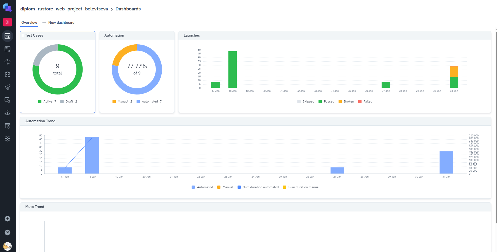

#### Общий список всех тест-кейсов

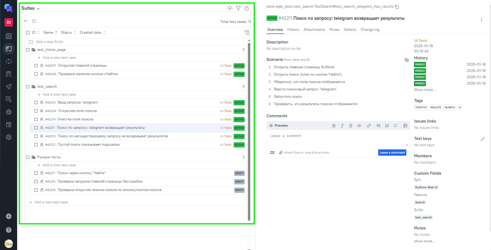

#### Автоматизированные и ручные тесты хранятся в одной директории


#### Пример отчёта выполнения одного из автотестов

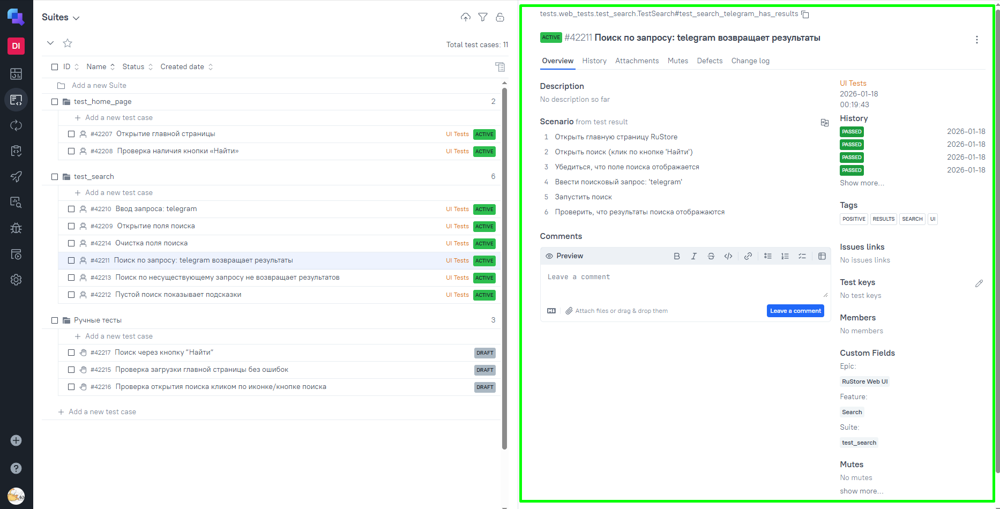

#### Пример dashboard с результатами запуска

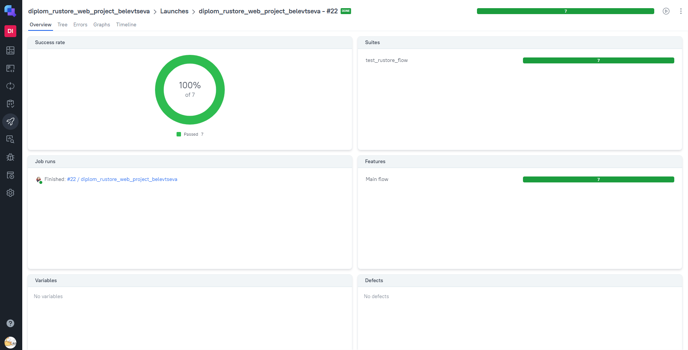

#### История запуска тестовых наборов

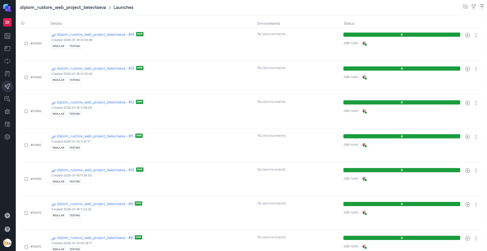

---
<a id="jira"></a>
###  Интеграция с Jira

### [Ссылка на задачу в Jira](https://jira.autotests.cloud/browse/HOMEWORK-1568)

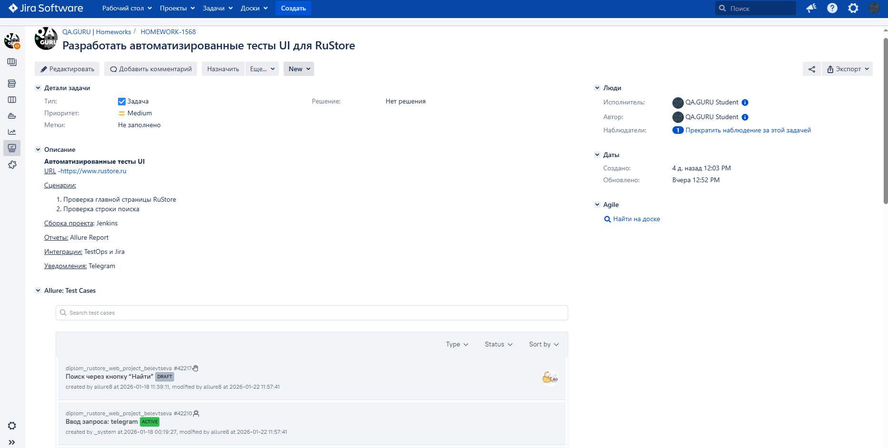
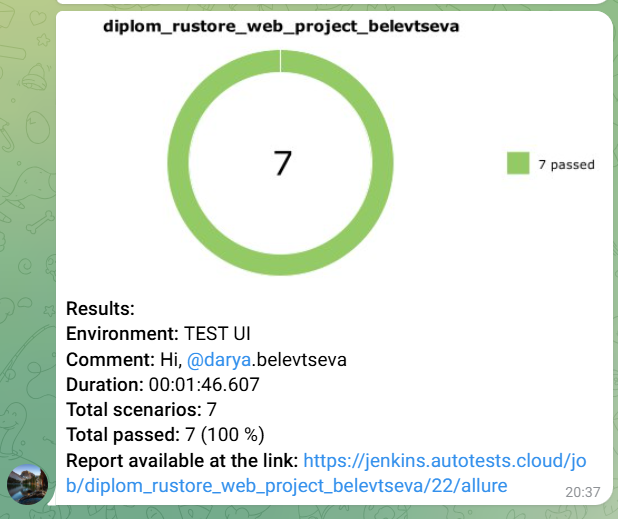
---
<a id="telegram"></a>
###  Оповещение о результатах прогона тестов в Telegram

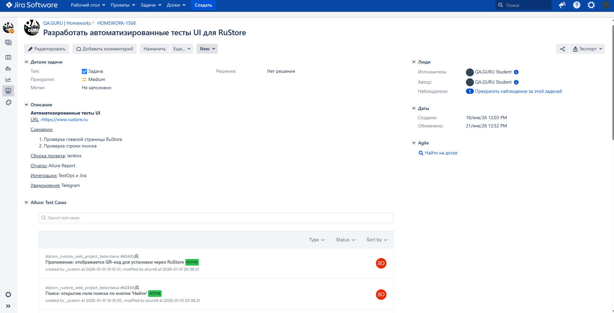

---
<a id="video"></a> 
### Пример видео прохождения ui-автотеста

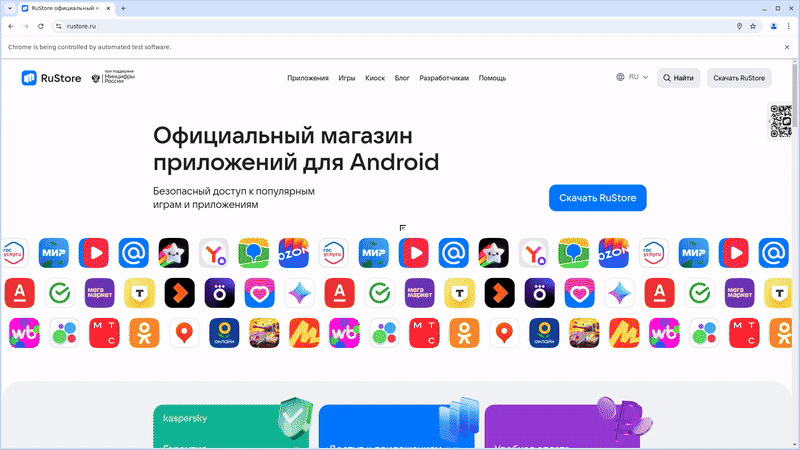